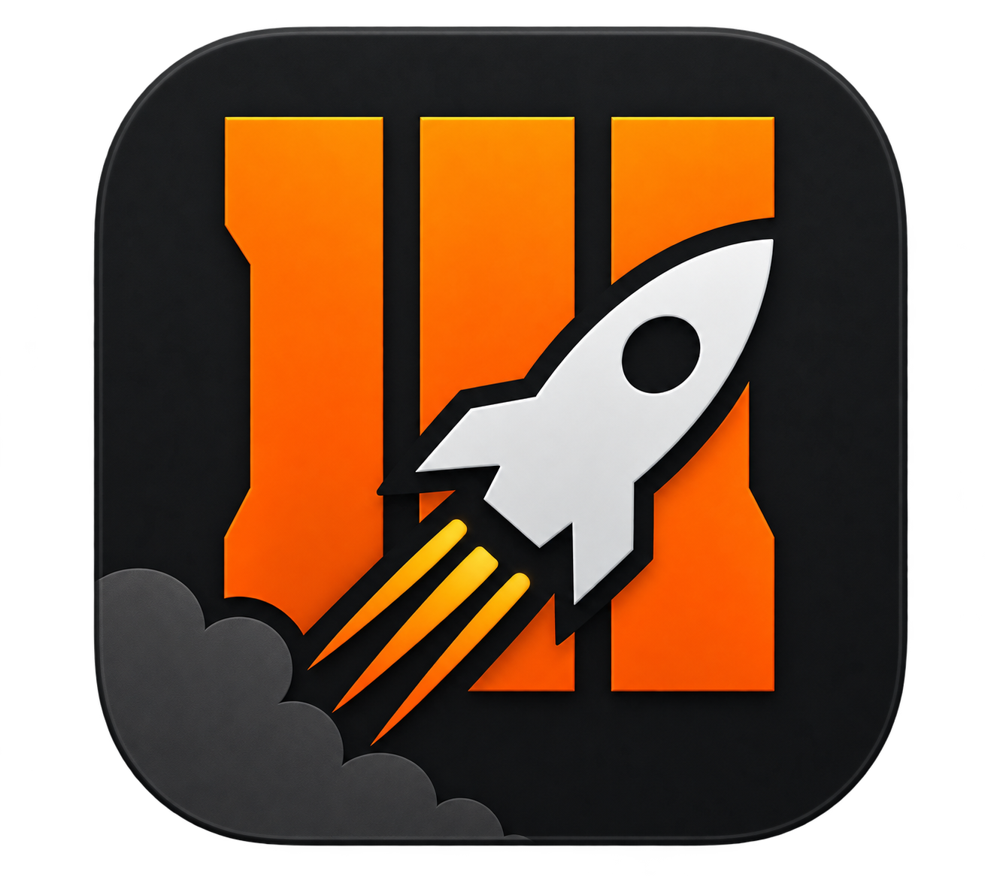

<h1 align="center">
   
  [ZXG] Réparateur Mod Tools BO3 
  &nbsp;
</h1>

### Réparez proprement l’installation des Mod Tools de Call of Duty: Black Ops III

Détectez l’installation Steam, vérifiez le dossier `455130` et restaurez la structure attendue de Black Ops III depuis une interface moderne, claire et sécurisée.

 

 

[**Télécharger la dernière version**](../../releases/latest)
&nbsp;&nbsp;•&nbsp;&nbsp;
[**Site officiel**](https://www.zxg.fr)
&nbsp;&nbsp;•&nbsp;&nbsp;
[**Discord**](https://discord.gg/4cb3ENTXd4)

---

## Présentation

**[ZXG] Réparateur Mod Tools BO3** est un utilitaire Windows conçu pour corriger le problème d’installation plaçant les fichiers des Mod Tools de **Call of Duty: Black Ops III** dans un dossier séparé `455130`.

L’application localise automatiquement Steam et Black Ops III, analyse la structure existante, contrôle l’espace disponible, puis guide l’utilisateur pendant une réparation sécurisée.

---

## Fonctionnalités

### Vérification

- Détection automatique de Steam et de ses bibliothèques
- Recherche de Call of Duty: Black Ops III
- Détection du dossier incorrect `455130`
- Lecture de `appmanifest_455130.acf`
- Vérification des fichiers et de l’espace disque
- Détection d’une installation déjà corrigée

### Réparation

- Fermeture normale de Steam depuis l’application
- Présentation claire de la source et de la destination
- Copie progressive avec fichier actuel, volume et vitesse
- Suppression de chaque source uniquement après validation de sa copie
- Sauvegarde du manifeste avant modification
- Correction de la valeur `installDir`
- Validation finale de la structure BO3

### Expérience utilisateur

- Interface Windows 10/11 moderne au thème orange ZXG
- Démonstration guidée sans modification des fichiers
- Animations fluides entre les étapes
- Journal détaillé de la session
- Accès direct au dossier final de Black Ops III
- Vérification des nouvelles versions via GitHub

---

## Langues disponibles

L’interface propose les langues suivantes :

| Langue | Disponible |
|:--|:--:|
| 🇫🇷 Français | ✅ |
| 🇬🇧 Anglais | ✅ |
| 🇪🇸 Espagnol | ✅ |
| 🇷🇺 Russe | ✅ |
| 🇩🇪 Allemand | ✅ |
| 🇮🇹 Italien | ✅ |
| 🇵🇹 Portugais | ✅ |
| 🇵🇱 Polonais | ✅ |
| 🇹🇷 Turc | ✅ |

La langue est demandée au premier lancement et reste modifiable depuis les paramètres.

---

## Installation

1. Ouvrez la page des [Releases GitHub](../../releases/latest).
2. Téléchargez **`ZXG.BO3.ModTools.Repair.-.1.0.0.exe.zip`**.
3. Extrayez complètement l’archive dans un dossier de votre choix.
4. Lancez **`ZXG_BO3_ModTools_Repair.exe`**.
5. Fermez Steam lorsque l’application vous le demande.

> L’application est autonome : aucune installation séparée de .NET n’est nécessaire.

---

## Configuration requise

- Windows 10 ou Windows 11 en 64 bits
- Steam
- Call of Duty: Black Ops III
- Mod Tools de Call of Duty: Black Ops III
- AppID du jeu : `311210`
- AppID des Mod Tools : `455130`

---

## Sécurité

- Aucune connexion Steam demandée
- Aucun mot de passe ou identifiant sensible enregistré
- Vérifications réalisées localement
- Sauvegarde du manifeste sous l’extension `.zxg.bak`
- Annulation contrôlée de la réparation
- Mode démonstration totalement fictif

> Fermez complètement Steam avant toute réparation afin d’éviter qu’il ne réécrive le manifeste pendant l’opération.

---

## Résolution des problèmes

### Black Ops III n’est pas détecté

Vérifiez que le jeu est installé depuis Steam et que sa bibliothèque est toujours enregistrée dans Steam.

### Le bouton Suivant reste désactivé

Fermez complètement Steam et corrigez toute erreur signalée pendant la vérification.

### Le dossier 455130 est absent

Si le manifeste indique déjà le dossier normal de Black Ops III, l’installation est probablement déjà corrigée. Dans le cas contraire, consultez le journal avant de poursuivre.

### Windows affiche un avertissement

Windows SmartScreen peut afficher un avertissement au premier lancement lorsqu’un exécutable n’est pas signé numériquement.

---

## Distribution

Ce dépôt distribue uniquement les versions compilées de l’application. Le code source n’est pas publié et tous les droits sont réservés à **STARZISMIK / ZXG**.

---

## Liens

---

Développé avec passion par **STARZISMIK**

**[ZXG] Réparateur Mod Tools BO3 — Version 1.0.0**

© 2026 STARZISMIK / ZXG

